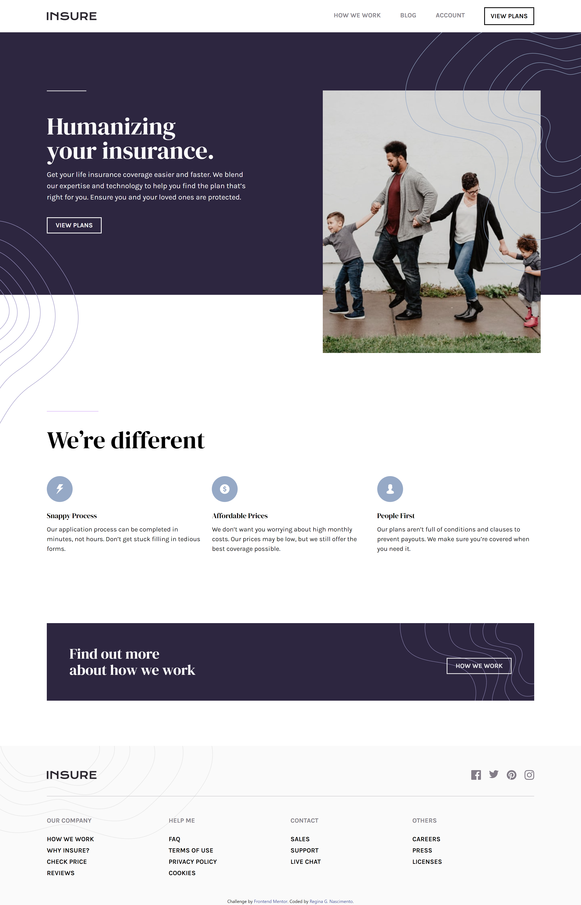

# Frontend Mentor - Insure landing page solution

This is a solution to the [Insure landing page challenge on Frontend Mentor](https://www.frontendmentor.io/challenges/insure-landing-page-uTU68JV8). Frontend Mentor challenges help you improve your coding skills by building realistic projects. 

## Table of contents

  - [The challenge](#the-challenge)
  - [Screenshot](#screenshot)
  - [Links](#links)
  - [Built with](#built-with)
  - [What I learned](#what-i-learned)
  - [Continued development](#continued-development)
  - [Useful resources](#useful-resources)
- [Author](#author)

### The challenge

Users should be able to:

- View the optimal layout for the site depending on their device's screen size
- See hover states for all interactive elements on the page

### Screenshot

### Links

- Live Site URL: [Add live site URL here](https://insure-project-landingpage.netlify.app/)

### Built with

- Semantic HTML5 markup
- Mobile-first workflow
- Tailwind CSS

### Continued development

- Learn about transitions and animations with Tailwind CSS for future projects.

### Useful resources

- [Tailwindcss Docs](https://tailwindcss.com/docs) 
- [Best Practices for Tailwind CSS](https://dev.to/olacampuspune/best-practices-for-tailwind-css-4p0n)

## Author

- Frontend Mentor - [@reginaguermandi](https://www.frontendmentor.io/profile/reginaguermandi)
